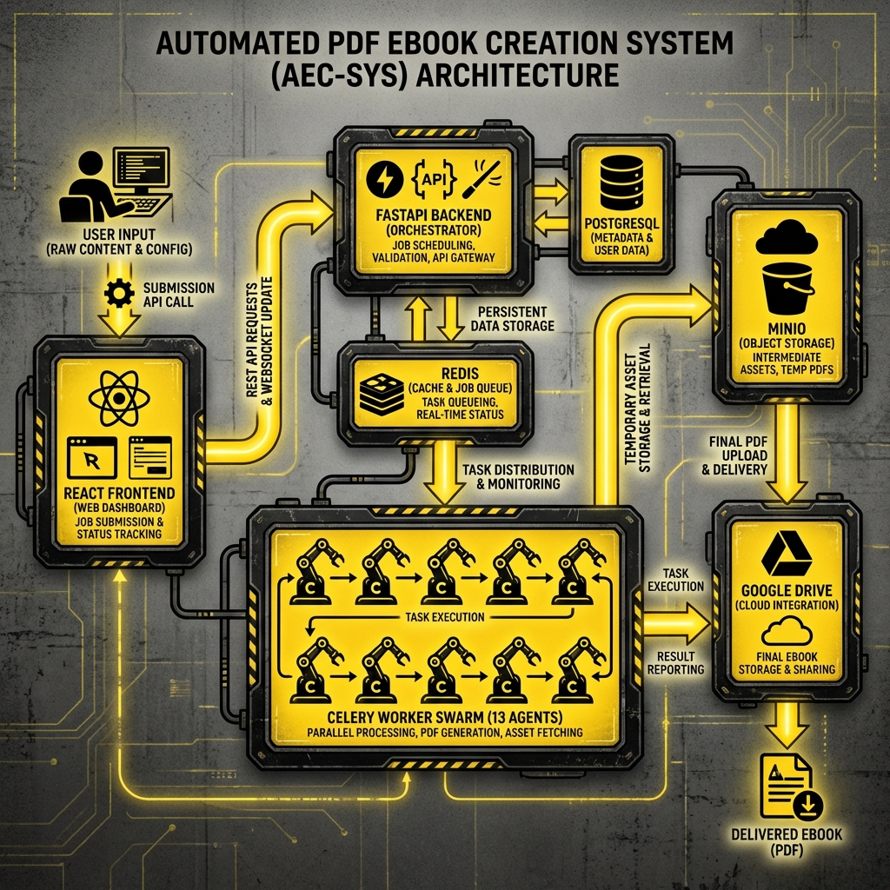

# 🚀 Automated PDF Ebook Creation System (AEC-SYS)

A premium, agent-driven orchestration platform for generating high-quality, fact-checked, and professionally formatted PDF ebooks with zero manual intervention.



## 🏛️ System Architecture

The **Automated PDF Ebook Creation System** is built on a high-availability, parallel-processing architecture designed for speed and resilience.

- **React Frontend**: A premium Neo-Brutalist dashboard for job submission, real-time monitoring, and historical oversight.
- **FastAPI Orchestrator**: The central brain that validates requests, manages user state, and dispatches tasks.
- **Celery Agent Swarm**: A powerful cluster of **13 specialized AI agents** that research, draft, verify, and design each ebook in parallel.
- **Dual-Sync Storage**: 
  - **Local (MinIO)**: For rapid intermediate asset storage and ephemeral drafts.
  - **Cloud (Google Drive)**: For secure, permanent delivery of finalized products via user-granted OAuth2 access.
- **Data Persistence**: PostgreSQL 15 provides granular, chapter-level state recovery even during heavy parallel processing.

## 🛠️ Tech Stack

| Layer | Technologies |
|-------|--------------|
| **Frontend** | React 18, Vite, TypeScript, Tailwind CSS, Framer Motion |
| **Backend** | FastAPI (Python 3.11+), Pydantic, SQLAlchemy Async |
| **Distributed Tasks** | Celery, Redis 7 (Broker & Backend) |
| **Database** | PostgreSQL 15 |
| **Object Storage** | MinIO (Internal S3), Google Drive API (External) |
| **AI Services** | Ollama (Local LLMs: Llama3.1, Mistral), Stable Diffusion XL |
| **PDF Generation** | WeasyPrint, Jinja2 Templates |

## 🧠 The 13-Agent Orchestration

The system employs a multi-agent swarm architecture to ensure depth and accuracy:
1. **Configuration Loader**: Initializes project specs.
2. **Topic Analysis**: Breaks down the topic sentence into deep research vectors.
3. **Content Strategist**: Creates a detailed chapter-by-chapter outline.
4. **Research Swarm**: Parallel agents gathering facts and sources.
5. **Chapter Generation**: Parallel drafting of multiple chapters.
6. **Infographic Designer**: Synthesizes visual concepts for each chapter.
7. **Visual Design Agent**: Directs image generation for high-impact diagrams.
8. **Quality Enhancer**: Refines language and flow.
9. **Critic & Proofreader**: 7-pass verification of grammar and consistency.
10. **Fact-Verification Agent**: Achieves 95%+ accuracy across external source checks.
11. **SEO & Metadata Agent**: Generates optimized tags and descriptions.
12. **Layout & Formatting**: Orchestrates HTML/CSS styles for the PDF engine.
13. **Storage Integrator**: Synchronizes final artifacts across the dual-storage layer.

## 🎨 Design Philosophy: Neo-Brutalism

The UI is built with a **Neo-Brutalist** design language to convey power, transparency, and a premium technical feel:
- **Bold Borders**: 4px-8px black strokes on all interactive elements.
- **High Contrast**: Vibrant yellow (#FFDD00) and pink (#FF00FF) against deep black (#000000).
- **Hard Shadows**: 6px-10px shadows with zero blur for sharp, mechanical aesthetics.
- **Micro-Animations**: Snappy transforms and smooth WebSocket-driven terminal transitions.

## 🚀 Getting Started

### Prerequisites
- Docker & Docker Compose
- Python 3.11+
- Node.js 18+

### Installation
1. **Clone the repository**:
   ```bash
   git clone https://github.com/itsshaikaslam/Anti_BookAutomationCheck.git
   cd Anti_BookAutomationCheck
   ```

2. **Setup Environment**:
   ```bash
   cp .env.example .env
   # Fill in your GDrive credentials and Secret Keys
   ```

3. **Launch Infrastructure**:
   ```bash
   docker-compose up -d --build
   ```

4. **Verify Health**:
   ```bash
   chmod +x scripts/health_check.sh
   ./scripts/health_check.sh
   ```

## 📅 Ongoing Documentation
- [Project Strategy](./mystrategy.md)
- [Feature Manifest](./features_list.json)
- [Development Progress](./ProjectProgress.md)

---
**Maintained by**: Antigravity AI Engineering
**Version**: 1.0.0-verified
