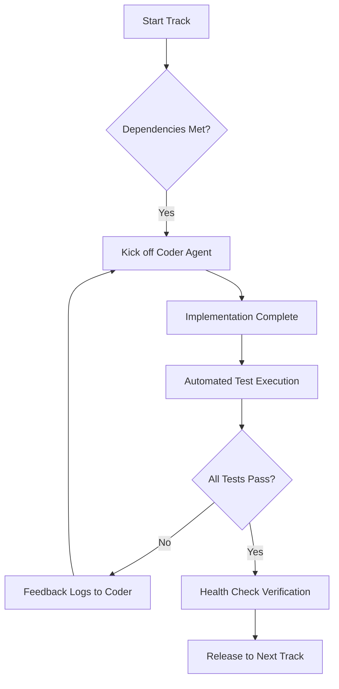

# Orchestration Strategy: Multi-Agent Parallel Implementation

This document outlines the coordination strategy for implementing the **Automated PDF Ebook Creation System**. The project is split into parallel implementation tracks, each assigned a **Coding Agent** and a **Code Review Agent**.

## 🏗️ Implementation Tracks & Parallelization

To maximize efficiency while respecting dependencies, the implementation is divided into four primary tracks and one final verification track.

### 🛤️ Track A: Foundation & Storage (P0)
**Objective**: Establish the infrastructure and data persistence layer.
- **Components**: 
  - [01-project-setup.md](file:///f:/bookmake2/implementation/01-project-setup.md)
  - [02-database-schema.md](file:///f:/bookmake2/implementation/02-database-schema.md)
  - [04-storage-layer.md](file:///f:/bookmake2/implementation/04-storage-layer.md)
- **Dependencies**: None.
- **Agent Assignment**:
  - 🤖 **Coder Agent A**: Infrastructure Specialist.
  - 🔍 **Review Agent A**: Security & Reliability Auditor.

---

### 🛤️ Track B: Agent Orchestration & API (P0)
**Objective**: Build the 13-agent pipeline and the backend interface.
- **Components**:
  - [05-api-and-actions.md](file:///f:/bookmake2/implementation/05-api-and-actions.md)
  - [06-types-and-constants.md](file:///f:/bookmake2/implementation/06-types-and-constants.md)
  - [03-authentication.md](file:///f:/bookmake2/implementation/03-authentication.md)
- **Dependencies**: Track A (Requires stable database connection).
- **Agent Assignment**:
  - 🤖 **Coder Agent B**: Python/AI Systems Engineer.
  - 🔍 **Review Agent B**: Logic & Concurrency Expert.

---

### 🛤️ Track C: Design System & Core UI (P1)
**Objective**: Implement the Neo-Brutalist design language and reusable components.
- **Components**:
  - [12-styling-guide.md](file:///f:/bookmake2/implementation/12-styling-guide.md)
  - [07-ui-components.md](file:///f:/bookmake2/implementation/07-ui-components.md)
  - [11-keyboard-navigation.md](file:///f:/bookmake2/implementation/11-keyboard-navigation.md)
- **Dependencies**: None (Can run in parallel with Tracks A and B).
- **Agent Assignment**:
  - 🤖 **Coder Agent C**: Frontend Designer.
  - 🔍 **Review Agent C**: UX & Accessibility Auditor.

---

### 🛤️ Track D: Specialized Modules (P2)
**Objective**: Implement feature-rich UI modules (Kanban, Calendar, Search).
- **Components**:
  - [08-kanban-board.md](file:///f:/bookmake2/implementation/08-kanban-board.md)
  - [09-calendar-view.md](file:///f:/bookmake2/implementation/09-calendar-view.md)
  - [10-filtering-system.md](file:///f:/bookmake2/implementation/10-filtering-system.md)
- **Dependencies**: Track B (API Data) & Track C (UI Components).
- **Agent Assignment**:
  - 🤖 **Coder Agent D**: Full-stack Application Developer.
  - 🔍 **Review Agent D**: Performance & State Management Specialist.

---

## 🔄 Automated Coordination Protocol (Zero Manual Intervention)

The implementation follows a strict **Automated Implement-Verify-Deploy** cycle, designed to run locally without human checkpoints.

### 📋 Automation Protocols

#### 📥 Zero-Intervention Verification
Instead of manual reviews, the **Review Agent** acts as an automation orchestrator:
1. **Static Analysis**: Runs `flake8`/`eslint` locally to ensure code quality.
2. **Dynamic Testing**: Executes the Pytest and Playwright suites defined in [13-testing-verification.md](file:///f:/bookmake2/implementation/13-testing-verification.md).
3. **Environment Sync**: Automatically runs `docker-compose up --build` if schema or environment changes are detected.

#### � Local Deployment Confirmation
The "Smooth Deployment" is guaranteed by the **Track A** foundation which uses Docker Compose to encapsulate all services (Redis, PG, MinIO, Ollama). Any failure in the `health_check.sh` script halts the track and triggers an immediate fix by the Coder Agent.

## 🏁 Track E: Continuous Verification
- **Automated Benchmarking**: Verified every time a new agent is integrated to ensure the <15 minute generation target is preserved.
- **Visual Regression**: UI changes are automatically compared against design baselines using snapshot testing.

